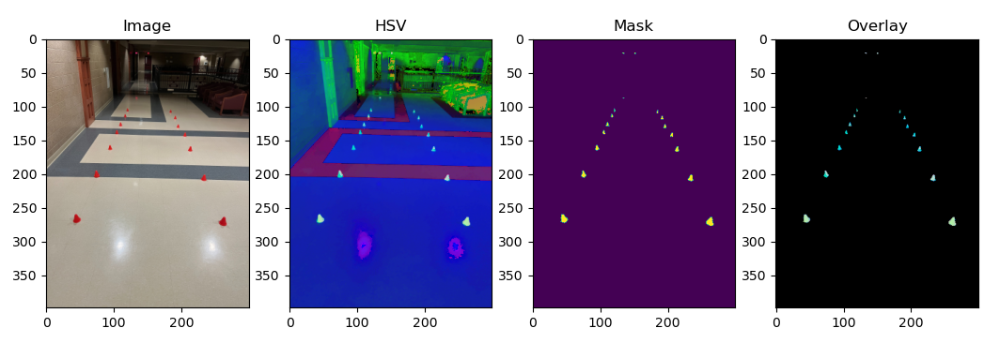

# Robot Lane Detection
Given an image with cones marking a path for a robot, the task is to map out the path using straight lines that connect the cones.

# Methodology
The problem can be broken into the following parts:
1. Detecting the red color
2. Filtering the contours based on shape of the cone
3. Finding the center of the cones in the image
4. Fitting a line through the cone centers and marking them

## Detecting red
To detect red, the image is converted to HSV space, which isolates the Hue channel, simplifying red detection. In contrast, RGB space requires precise manipulation of the R, G, and B channels, which combine to create different shades of red. I use an HSV slider to determine the optimal lower and upper bounds for masking the red color. This mask is then used for further processing.

  

## Filtering contours
For contour filtering, the OpenCV implementation is used, which is based on the algorithm described in the paper "Topological Structural Analysis of Digitized Binary Images by Border Following" by Suzuki and Abe. The algorithm scans the image mask from top to bottom, identifying border points. Once a border is found, it traces along the contour using 8-connected neighbors, ensuring consistent directional movement for smooth contour extraction. Additionally, the algorithm supports hierarchical border detection, which helps track holes within contours.
Contours with areas exceeding a certain threshold are classified as cones, effectively filtering out noise

  

## Finding contour center
For each filtered contour we need to find the zero-order and first-order moment. The zero-order moment gives the area of the contour. The first-order moment M10 and M01 provides the sum of contour coordinates in x and y direction respectively. So dividing by the zero-order moment gives the center coordinates of the contour

## Best fit line
The last step is to fit two lines through the left and right half centers. I use np.polyfit() that tries to fit a polynomial by minimizing the squared error loss.

  

The final result looks like this

  

# Libraries
For the code, I used the cv2, numpy and matplotlib library